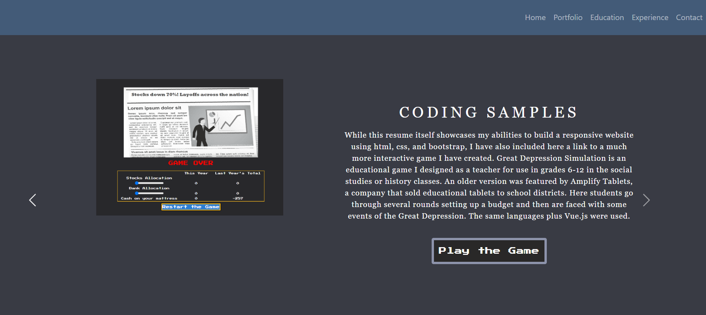

# yohanhwang12.github.io

This is my online resume which also contains a link to an educational game that simulates the Great Depression. They are frontend projects running on HTML, CSS, JavaScript, Bootstrap and Vue.js.

## Getting Started

This project is up and running as a github page. Simply copy and paste the following address in your browser's address bar: yohanhwang12.github.io 

You can navigate the resume simply by scrolling or using the navbar at the top. 

To access the Great Depression game, go to the Portfolio section. The carousel contains my portfolio which features my work in various areas. There is a coding, writing and teaching portfolio provided on the links.
For the coding part, on the page that says "Coding Samples", if you click "Play the Game" it will open a new tab with the game on it:

## Description

Several years ago, an Android version of the game was featured by Amplify Tablets, then an educational company that made tablets for use in schools.
In the game students have to make decisions as to where to allocate their money, be it in the stock market, the bank or under their mattress.
Of course the game is a simulation of the Great Depression so after an exhilarating times in the markets, they experience a stock rout
and even a bank run.

The resume features a navbar, carousel, accordion and a form. The game features sound effects, animations, and range sliders that interact with each other
for user validation.

